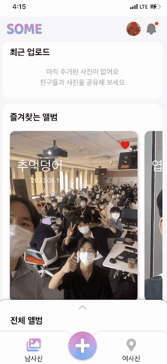
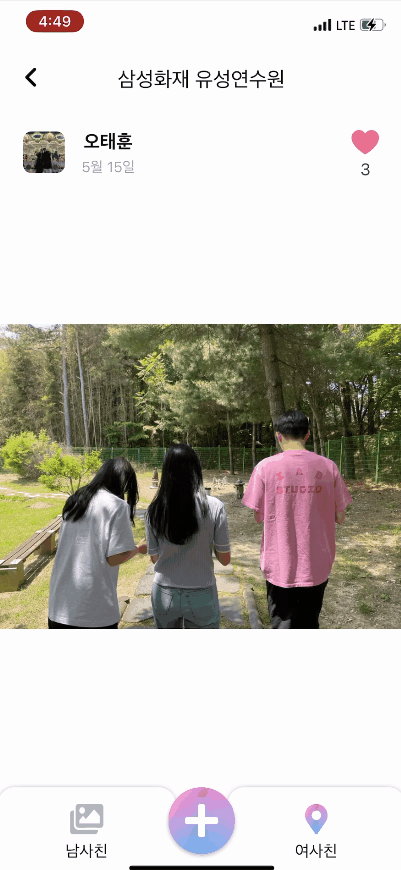
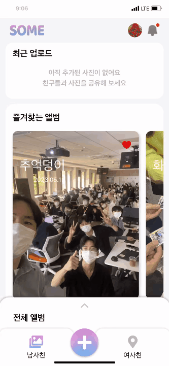

# 📷👨🏻‍🤝‍👨🏻 S.O.M.E.(Share Our Memory Everywhere) 👨🏻‍🤝‍👨🏻📷

### [링크 바로가기](https://some-album.com/)
### [플레이 스토어 바로가기](https://play.google.com/store/apps/details?id=io.ssafy.p.k8b301.twa)


---

## :clapper: 소개 영상

### [UCC 링크](https://www.youtube.com/watch?v=TMUya0yS6mA)

<br>

## :date: 프로젝트 진행 기간

- _2023/4/10 ~ 2023/5/19 (6주)_
- SSAFY 8기 자율 프로젝트
  <br>

## :heavy_check_mark: SOME - 배경

- 친구들과 사진을 공유해 본 경험 있으신가요?
- 많은 사진을 공유하려면 기존의 서비스들은 아쉬웠던 점이 많았습니다.
- 다른 사람들은 같은 장소에서 어떻게 사진을 찍었는지 궁금했습니다.
- 그래서, 사진 공유 서비스 SOME을 개발했습니다!
  <br>

## :heavy_check_mark: SOME - 개요

- 공유 앨범에 친구를 쉽게 초대하고, 편하게 사진을 업로드 하세요.
- 공유한 사진을 AI를 활용해 편하게 분류하여 제공합니다.
- 잘 찍은 사진을 그 장소에 등록해서 자랑하세요.
  <br>

## :pushpin: 주요 기능

- **남사친**
  - 목적에 맞는 공유 앨범 생성
  - 카카오톡 연동 친구 초대
  - AI 자동 사진 분류
  - SNS 업로드 동의 요청
- **여사친**
  - 내 위치에 사진 남기기
  - 내 주변에 등록된 사진 보기
  - 마음에 드는 사진에 좋아요 남기기

<br>

## :art: 주요 기술

- **AI**

  - YOLO
    <br>

- **FrontEnd**

  - Next.js
  - TypeScript
  - SCSS
  - Tailwind
  - React-Query
  - Redux Toolkit
  - PWA
  - Kakao API (Map, Auth, Local)
    <br>

- **BackEnd**

  - Java 11
  - Spring Boot
  - Spring Data JPA
  - QueryDSL
  - MySQL
  - mongoDB
  - Redis
  - RabbitMQ
  - fastAPI
  - SSE
    <br>

- **Infrastructure**
  - Docker
  - Kubernetes
  - AWS CLI
  - Amazon S3
  - Elastic Container Registry
  - Jenkins
  - Gitlab
  - SonarQube
    <br>

## :art: 버전 정보

### Ver 1.0 (~ 4/27)

- `Client`
  - 남사친, 사진 상세, 친구 초대, 앨범 상세 페이지, 마이페이 구현
  - PWA 설정
  - 로그인 기능 구현
- `Server`

  - AI 사진 분류, mongoDB 연동, 로그인 서버 개발

  #### 1.1

  - `Client`
    - 목업 서버(Json Server)를 활용한 API 테스트
  - `Server`
    - OAUTH -> kakao 소셜 로그인
    - AI 카테고리 커스텀
    - mongoDB queryDSL 연동

### Ver 2.0 (~ 5/4)

- `Client`
  - 사진 업로드 기능, 사진 집중모드 구현
  - 리덕스 세팅
  - 서비스워커 Notification 설정
  - React-Query를 활용한 API 연결
- `Server`

  - 남사친 API 개발
  - 사진파일 메타데이터 추출
  - S3 연동
  - SSE 알림 연동

  #### 2.1

  - `Server`
    - 파일 압축 업로드
    - S3 폴더 관리

### Ver 3.0 (~ 5/19)

- `Client`
  - 여사친 페이지 구현
  - 사진 줌인, 줌아웃, 좋아요, 대표이미지 설정 기능 구현
  - 다운로드 및 업로드 기능 구현
- `Server`
  - 여사친 API 개발
  - RabbitMQ 구현
  - 알림 서버 개발
  - Redis 연동

#### 3.1

- `Client`
  - 사진 옆으로 넘기기 기능 구현
  - 여사친 지도 및 기능 구현
  - 사진 공유 기능 구현
- `Server`
  - 카카오 친구목록 연동
  - 알림 기능 고도화

#### 3.2

- `Client`
  - CSS 디자인 수정
  - Next/image 컴포넌트를 활용한 이미지 최적화
    <br>

## :open_file_folder: 시스템 아키텍처


## :open_file_folder: 프로젝트 파일 구조

### FrontEnd

```
└frontend
    ├─components
    │   ├─album
    │   ├─album-starter
    │   ├─notification
    │   ├─photo-detail
    │   └─profile
    ├─features
    ├─lib
    ├─nginx
    ├─pages
    │   ├─album
    │   │    └─[album_id]
    │   │       └─[photo_id]
    │   │           └──[page_idx]
    │   │                └─[index]
    │   ├─api
    │   ├─boy-home
    │   ├─desktop
    │   ├─girl-home
    │   │    └─[list]
    │   │       └─[photo_id]
    │   ├─invite
    │   ├─login
    │   └─oauth
    ├─public
    │   ├─favicons
    │   ├─icons
    │   ├─images
    │   └─splash_screens
    ├─store
    ├─styles
    └─types

```

### BackEnd 1: 남사친 서버

```
some-friendboy
    └─src
        ├─main
        │  ├─generated
        │  ├─java
        │  │  └─com
        │  │      └─ssafy
        │  │          └─somefriendboy
        │  │              │  SomeFriendboyApplication.java
        │  │              │
        │  │              ├─config
        │  │              │      AmazonS3Config.java
        │  │              │      MongoDBConfig.java
        │  │              │      RabbitConfig.java
        │  │              │      RedisConfig.java
        │  │              │      WebMvcConfig.java
        │  │              │
        │  │              ├─controller
        │  │              │      AlbumController.java
        │  │              │      AlbumPhotoController.java
        │  │              │      NotiController.java
        │  │              │      UserController.java
        │  │              │
        │  │              ├─dto
        │  │              │
        │  │              ├─entity
        │  │              │  │  Album.java
        │  │              │  │  AlbumFav.java
        │  │              │  │  AlbumMember.java
        │  │              │  │  AlbumPhoto.java
        │  │              │  │  AlbumPhotoSNS.java
        │  │              │  │  FeedBack.java
        │  │              │  │  Notification.java
        │  │              │  │  PhotoCategory.java
        │  │              │  │  User.java
        │  │              │  │  UserPhotoLike.java
        │  │              │  │
        │  │              │  ├─id
        │  │              │  │
        │  │              │  └─status
        │  │              │
        │  │              ├─repository
        │  │              │  ├─album
        │  │              │  │
        │  │              │  ├─albumfav
        │  │              │  │
        │  │              │  ├─albummember
        │  │              │  │
        │  │              │  ├─albumphoto
        │  │              │  │
        │  │              │  ├─albumphotosns
        │  │              │  │
        │  │              │  ├─noti
        │  │              │  │
        │  │              │  ├─user
        │  │              │  │
        │  │              │  └─userphotolike
        │  │              │
        │  │              ├─service
        │  │              │      AlbumPhotoService.java
        │  │              │      AlbumService.java
        │  │              │      AmazonS3Service.java
        │  │              │      NotiService.java
        │  │              │      UserService.java
        │  │              │
        │  │              └─util
        │  │
        │  └─resources
        │          application.yml

```

### BackEnd 2: 여사친

```
some-friendgirl
    └─src
        ├─main
        │  ├─generated
        │  ├─java
        │  │  └─com
        │  │      └─ssafy
        │  │          └─somefriendgirl
        │  │              │  SomeFriendgirlApplication.java
        │  │              │
        │  │              ├─config
        │  │              │      AmazonS3Config.java
        │  │              │      MongoDBConfig.java
        │  │              │      RedisConfig.java
        │  │              │      WebMvcConfig.java
        │  │              │
        │  │              ├─controller
        │  │              │      AlbumController.java
        │  │              │      PhotoController.java
        │  │              │
        │  │              ├─dto
        │  │              │
        │  │              ├─entity
        │  │              │      AlbumPhoto.java
        │  │              │      AutoIncrementSequence.java
        │  │              │      PhotoLikeStatus.java
        │  │              │      PhotoStatus.java
        │  │              │      User.java
        │  │              │
        │  │              ├─redis
        │  │              │      RedisScheduler.java
        │  │              │
        │  │              ├─repository
        │  │              │  ├─album
        │  │              │  │
        │  │              │  ├─photo
        │  │              │  │
        │  │              │  └─user
        │  │              │
        │  │              ├─service
        │  │              │      AlbumService.java
        │  │              │      AmazonS3Service.java
        │  │              │      PhotoService.java
        │  │              │
        │  │              └─util
        │  │                      GetResponse.java
        │  │                      HttpUtil.java
        │  │                      MongoQueryUtil.java
        │  │                      ResponseUtil.java
        │  │
        │  └─resources
        │          application.yml
```

### AI

```
ai
 └─ fast.py
```

<br>

## 🤝 협업 툴

- Git
- Notion
- JIRA
- MatterMost
- Webex
- Discord
- Kakaotalk
  <br>

## :clipboard: 프로젝트 산출물

- [서비스기획서](https://www.notion.so/b173d37cba5b4e9e969ebba75f4e55e7)
- [기능명세서](https://www.notion.so/3f14f23d87ad4a44bc8b7a25e3e99677?v=08794510cc7348658f1588d063464dd4&pvs=4)
- [회의록](https://www.notion.so/515356e2d5b44df89a6d6698d132683d)
- [Jira](https://www.notion.so/JIRA-55029bb25c5c4fa6a90080f17290cd29)
- [아키텍처](https://www.notion.so/dbf3bc6ba4ca4eec9e7a49512bbd82ed)
- [와이어프레임](https://www.figma.com/file/pz0IKJ0MUDdbW6McHsjjsR/%EC%99%80%EC%9D%B4%EC%96%B4-%ED%94%84%EB%A0%88%EC%9E%84?type=design&node-id=0%3A1&t=wYKlFGL9ZbBE09U0-1)
- [컨벤션](https://www.notion.so/a0528901fc77473c99b48a5535a37eaf)
- [API 명세서](https://www.notion.so/API-4d3b372debb34bec9163a956bb00ce4f)
- [ERD](https://www.notion.so/fdb2ffd4fe5e4ff2a20a8e020df68cd9?v=1ace44a24be9481b8897deebeb4a1089)
- [회의록](https://www.notion.so/515356e2d5b44df89a6d6698d132683d?pvs=4)
- [최종발표 PPT](./docs/중간발표PPT.pptx)
- [중간발표 PPT](./docs/최종발표PPT.pptx)
- [포팅메뉴얼](https://www.notion.so/23c6e70cbd364b9cb5fa3f56b468362c)

<br>

## :sparkles: 서비스 화면

### 🙋‍♂️ 남사친 (남는 건 사진이야, 친구야!)

1️⃣ 홈 화면

- 즐겨찾는 앨범, 전체 앨범

  

2️⃣ 최근 업로드

- 최근 앨범에 업로드된 사진 확인

  

3️⃣ 앨범 생성

- 목적에 맞는 새로운 앨범 생성
- 카카오톡 연동을 통한 친구 초대

  

4️⃣ 카톡으로 친구 초대하기

- SOME에 가입하지 않은 친구에게 카카오톡 보내기

  

5️⃣ 앨범 참여하기

- 앨범에 초대되면 푸시 알림 수신
- 알림 페이지를 통해 요청 수락

  

6️⃣ 앨범 상세보기

- 유저 및 카테고리 별 사진 분류

  

- 여러 사진 다운로드

  

- 사진 업로드 (사진 선택)

  

- 사진 업로드 (사진 찍기)

  

7️⃣ 사진 상세보기

- 줌인, 줌아웃 기능
- 좋아요, 대표 이미지 설정 기능

  

- 다운로드 및 삭제 기능

  

8️⃣ SNS 요청

- 알림을 통해 SNS 공유 요청 수락
- SNS 요청 현황 확인

  

### 🙋‍♀️ 여사친 (여기에 사진 남겼어, 친구야!)

1️⃣ 사진 업로드

- 현재 위치에 사진 업로드

  

2️⃣ 현재 위치의 사진 확인

- 현재 위치 주변의 사진 목록 확인
- 정렬 기준 변경

  

3️⃣ 사진 상세보기

- 좋아요 기능

  

### 🤼 마이페이지

- 활동 이력 확인
- 알림 설정
- 계정 설정

  

- 로그아웃 및 로그인

  
  <br>
